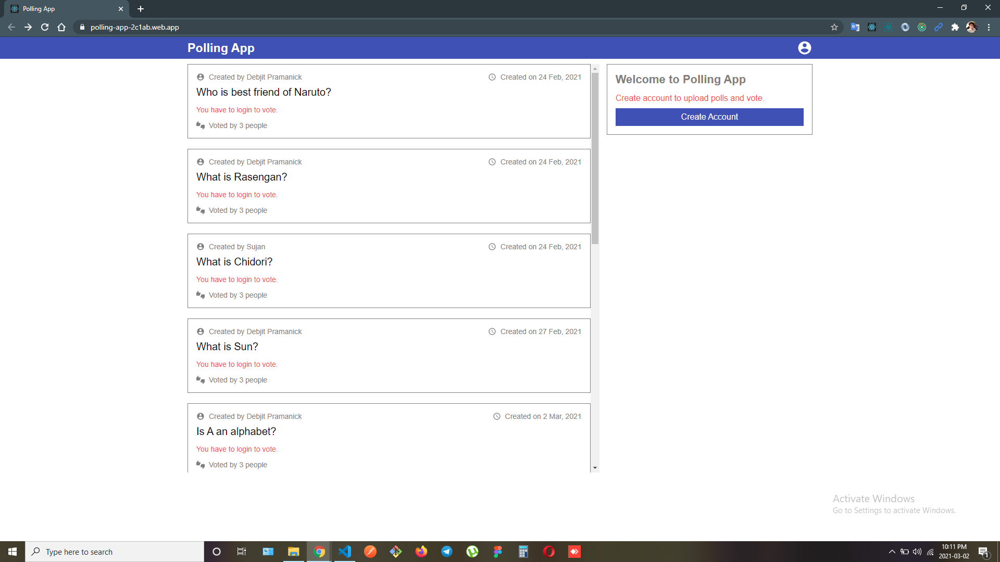
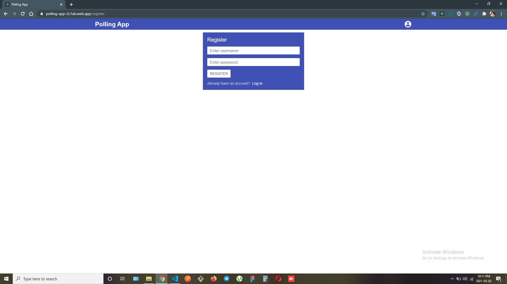
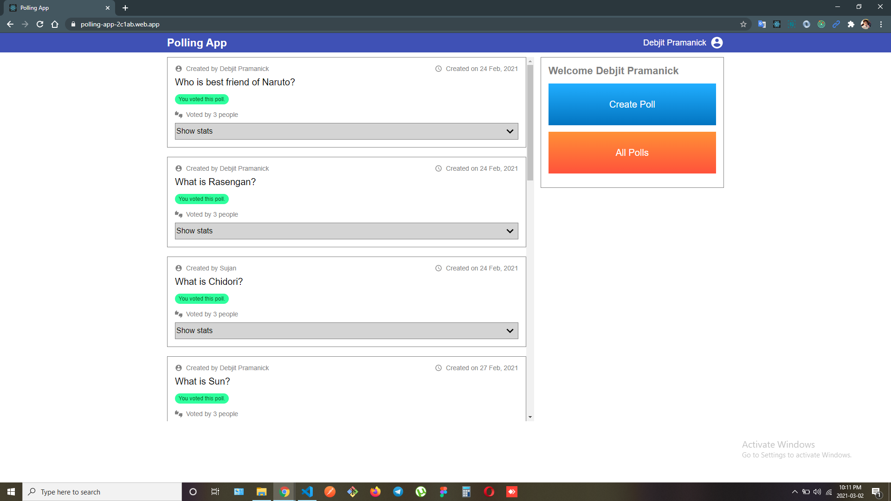
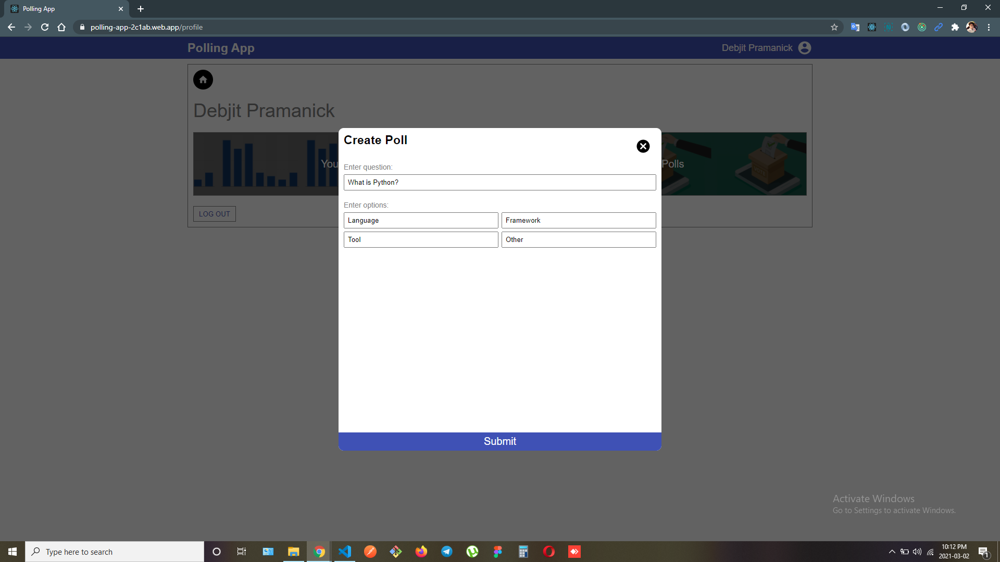
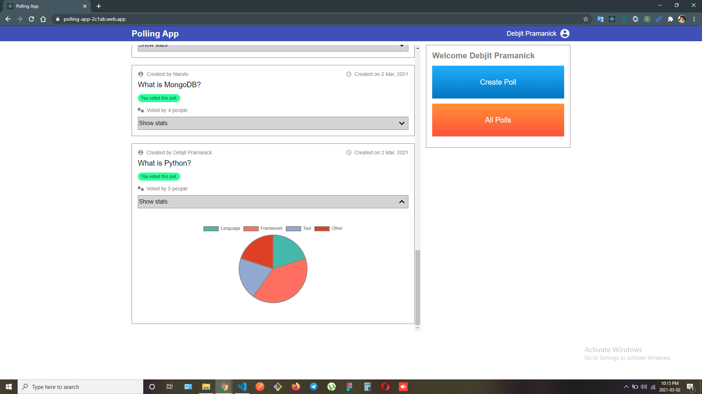

# POLLING APP

Hi! I'm Debjit, a **MERN Stack Developer**. This is a clone of popular project management application **Polling App**. I have created it with **React** in frontend,  **Node and Express** for backend and **MongoDB** for storing data.
 
 
> ### Web App Link - https://polling-app-2c1ab.web.app/

 

## Features

- Sign-in/Sign-up
- Create Polls
- Vote Polls
- Delete Poll
- See Stats of Each Poll

##  NPM Packages Used

- React-redux
- Material UI
- Express
- Nodemon
- Mongoose
- JWT
- Brypt.js
- Axios
- React Chart.js 2

## Screenshots

 

 

 

 

 
